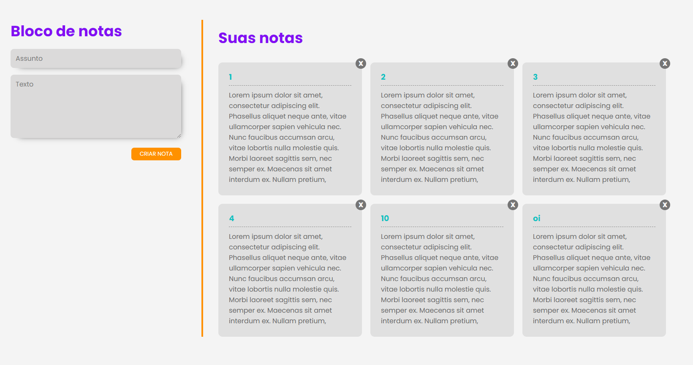

<p align="center">
  <a href="#page_facing_up-descrição">Descrição</a>&nbsp;&nbsp;&nbsp;|&nbsp;&nbsp;&nbsp;
  <a href="#-tecnologias">Tecnologias</a>&nbsp;&nbsp;&nbsp;|&nbsp;&nbsp;&nbsp;
  <a href="#clipboard-Funcionalidades">Funcionalidades</a>&nbsp;&nbsp;&nbsp;|&nbsp;&nbsp;&nbsp;
  <a href="#closed_book-instalação">Instalação</a>&nbsp;&nbsp;&nbsp;|&nbsp;&nbsp;&nbsp;
  <a href="#man-Autor">Autor</a>&nbsp;&nbsp;&nbsp;|&nbsp;&nbsp;&nbsp;
  <a href="#memo-Licença">Licença</a>
</p>



## :page_facing_up: Descrição
O Ideafix-notes é uma aplicação web onde o usuário pode armazenar as suas notas personalizadas e nunca mais se esquecer de coisas importantes.

## 🛠 Tecnologias
Este projeto foi desenvolvido com as seguintes tecnologias

- [Node.js](https://nodejs.org/en/)
- [React.js](https://pt-br.reactjs.org/)
- [MongoDB](https://www.mongodb.com/2)

## :closed_book: Instalação

### Pré-requisitos
Antes de começar, você vai precisar ter instalado em sua máquina as seguintes ferramentas:
[Git](https://git-scm.com), [Node.js](https://nodejs.org/en/).
Além disto é bom ter um editor para trabalhar com o código como [VSCode](https://code.visualstudio.com/)

## :closed_book: Instalação

### 🎲 Rodando o Back End

```bash
# Clone este repositório
$ git clone https://github.com/FeSilva-dev/Ideafix-notes.git

# Vá para o backend
$ cd notes-backend

# Instale as dependências
$ yarn install

# Execute a API
$ yarn run dev

# O servidor inciará na porta 3333 - url <http://localhost:3333>
```

### 💻️ Rodando o Front End

```bash
# Vá para a pasta web
$ cd notes-frontend

# Instale as dependências
$ yarn install

# Execute aplicação
yarn start

# O app vai está rodando na porta 3000 - acesse <http://localhost:3000>
```