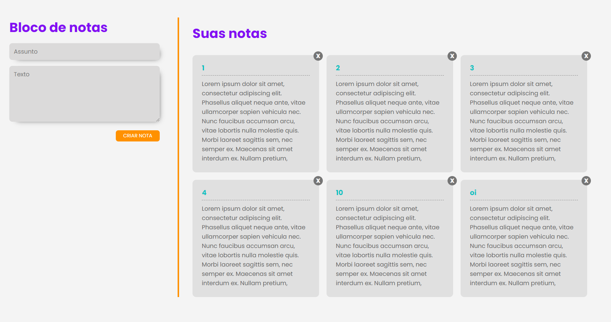

<p align="center">
  <a href="#page_facing_up-descrição">Descrição</a>&nbsp;&nbsp;&nbsp;|&nbsp;&nbsp;&nbsp;
  <a href="#-tecnologias">Tecnologias</a>&nbsp;&nbsp;&nbsp;|&nbsp;&nbsp;&nbsp;
  <a href="#clipboard-Funcionalidades">Funcionalidades</a>&nbsp;&nbsp;&nbsp;|&nbsp;&nbsp;&nbsp;
  <a href="#closed_book-instalação">Instalação</a>&nbsp;&nbsp;&nbsp;|&nbsp;&nbsp;&nbsp;
  <a href="#man-Autor">Autor</a>&nbsp;&nbsp;&nbsp;|&nbsp;&nbsp;&nbsp;
  <a href="#memo-Licença">Licença</a>
</p>



## :page_facing_up: Descrição
O Ideafix-notes é uma aplicação web onde o usuário pode armazenar as suas notas personalizadas e nunca mais se esquecer de coisas importantes.

## 🛠 Tecnologias
Este projeto foi desenvolvido com as seguintes tecnologias

- [React.js](https://pt-br.reactjs.org/)
## :clipboard: Funcionalidades
- [x] Criar notas.
- [x] Excluir notas.

## :closed_book: Instalação

### 💻️ Rodando o Front End

```bash
# Vá para a pasta web
$ cd notes-frontend

# Instale as dependências
$ yarn install

# Execute aplicação
yarn start

# O app vai está rodando na porta 3000 - acesse <http://localhost:3000>
```

## :man: Autor

<a href="https://github.com/FeSilva-dev">
 
 <br />
 <sub><b>Felipe Silva</b></sub>
</a>


Feito com carinho por Felipe Silva :wave::wave: Entre em contato!🚀

## :memo: Licença

Copyright © 2020 [Felipe Silva](https://github.com/FeSilva-dev).
